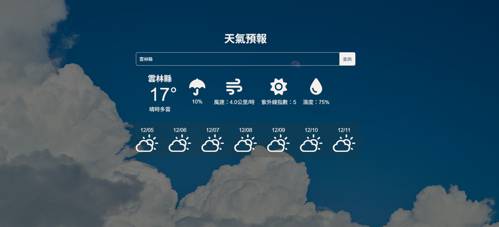

# 天氣預報網頁

🟢 [立即查看 DEMO](https://gpyuan.github.io/weather-app-3/)

# 截圖

## 白天畫面


## 晚上畫面


## 手機畫面


# 簡介

使用 React 製作的簡單天氣預報網頁，可查詢台灣城市的即時天氣與 7 日預報。icons 及背景圖片依日夜切換，並有響應式設計。

## 功能特色

- 查詢指定城市的即時天氣
- 顯示 7 日天氣預報與溫度、降雨機率、風速、紫外線指數、濕度
- 日夜背景自動切換
- 使用 Weather Icons 顯示天氣圖示
- 響應式設計，適用桌機與行動裝置
- 點擊每日預報可切換主要天氣資訊

## 技術

- React (Functional Components + Hooks)
- CSS Flexbox / Grid
- OpenData 台灣氣象資料 API
- Weather Icons

## 專案結構

```
weather-app/
├─ src/
│  ├─ components/
│  │  ├─ WeatherWrapper.jsx
│  │  ├─ WeatherCard/
│  │  │  ├─ WeatherCard.jsx
│  │  │  └─ DayCard.jsx
│  │  ├─ WeatherWindow.jsx
│  │  └─ SearchBar.jsx
│  ├─ hooks/
│  │  └─ useWeather.js
│  ├─ App.js
│  └─ App.css
├─ public/
└─ package.json
```
